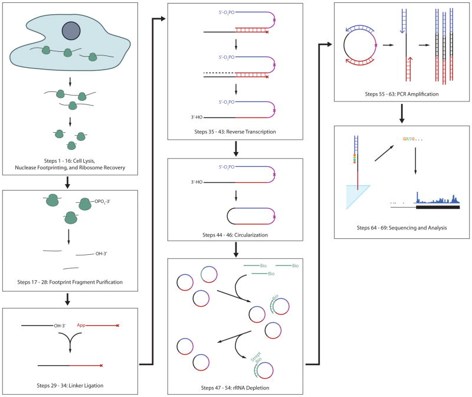

# Ribosome Profiling

## Procedures
**DNA library Preparation**    
Similar to RNA-seq, the preparation of ribosome profiling libraries requires cell lysis, mRNA purification, and reverse transcription. Here's an overview of the steps:
1) We first need to freeze the translation in cells before lysing them by treating them with elongation inhibitors, such as cycloheximide. To interrogate the initiation site of translation, the cells should be treated with harringtonine, which would cause the ribosomes to accumulate at initiation codons. 
2) After appropriate treatments, the cell should now be ready to be lysed by lysis reagents. For animal-derived samples, such as tissues that need to be physically disrupted, it is a robust approach to cryogenically pulverize the tissues and then thaw the tissues in the translation inhibitors. Note that these first two steps may vary depending on the types of samples and species.
3) Nuclease would then be used to digest regions on mRNA that are not protected by ribosomes. 
4) Next, an ultracentrifuge needs to be performed to spin down and separate the mRNA-ribosome complex with the naked mRNA. The ribosomes would then be washed off the mRNA.
The mRNA sequences are now obtained. The next steps are to sequence them.
5) Linker sequences would first be ligated to the 3’ end of the mRNA fragments.
6) Reverse transcriptase and primers would then be added to perform a reverse transcription.
7) Among the cDNA reverse transcription products, many are rRNA contamination that needed to be eliminated by hybridizing them with biotinylated sense strand oligonucleotides and then treating with streptavidin which would bind to the biotin. Note that contamination may be still present after this step, further elimination of this contamination would need to be done in the later bioinformatics data analysis.
8) The rest of the cDNA would next be PCR amplified to create a ribosome footprint library.

**Data Analysis**
The bioinformatics data analysis of ribosome profiling has many overlaps with that of RNA-seq, and many pipelines and packages have been established for different analysis purposes. 
The graph below shows an overview of a STAR Protocol of ribosome profiling data analysis pipeline specialized in ribosome pausing analysis (link to this paper [link](https://star-protocols.cell.com/protocols/1899)):
1) Preparation: raw read fastq files and reference genome of the species need to be downloaded (previously published datasets can be downloaded from SRA). 
2) Preprocessing: similar to RNA-seq, before the alignment we also need to trim off the adapter sequence from the reads and do quality control. One extra step is that we need to discard reads that are too short because they might be ncRNA contamination. These can be done in one step using fastx_toolkit using fastx_clipper command with various options:
    '> fastx_clipper -Q<phred_score> -a <adapter_sequence> -l <minimum_read_length_to_keep> -i <input.fastq> -o <output.fastq>'
3) Read alignment: to further eliminate contamination from ncRNA, the raw reads need to be first aligned to the ncRNA reference genome, and discard the aligned reads 
The creation of ncRNA indices and the alignment to the indices can be done using bowtie2:
    '''
    bowtie2-build <reference_ncRNA_sequences.fa> <prefix_of_output files>
    bowtie2 -L <seed_substring_length> --un=<path_where_unmatched_reads_would_be_saved> -x <reference_ncRNA_indices> > <output.sam>
    '''

{: width="50%"}.
